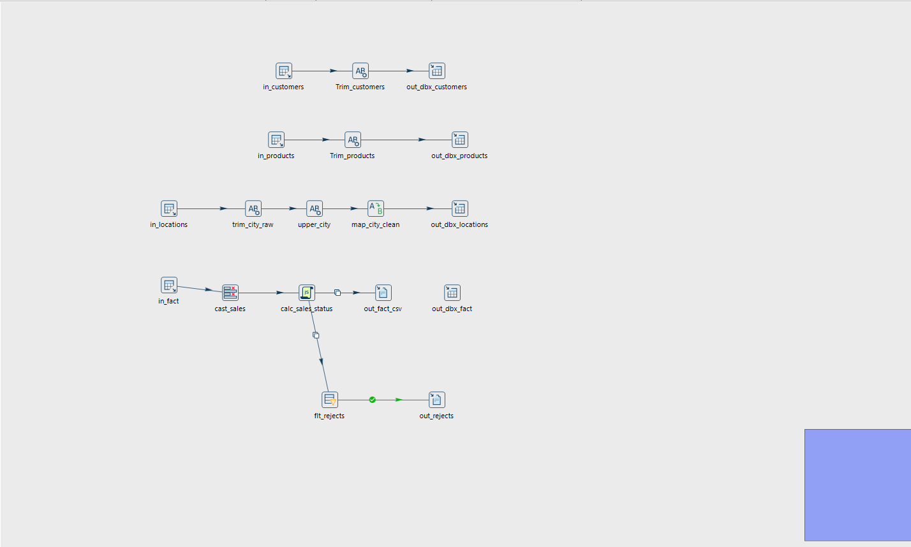
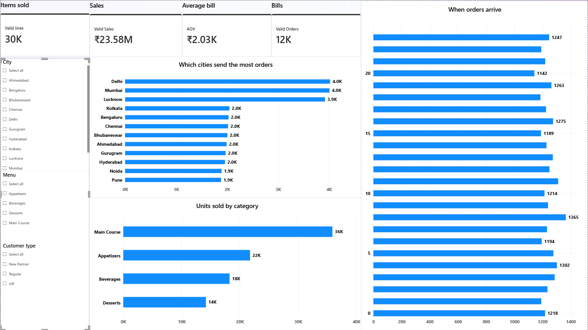
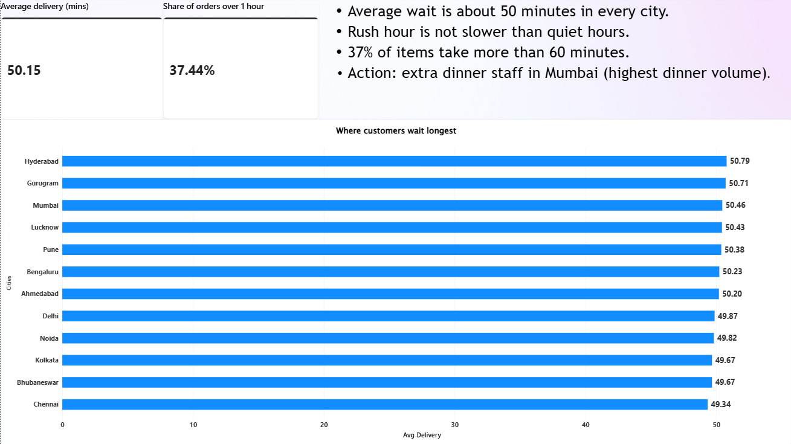
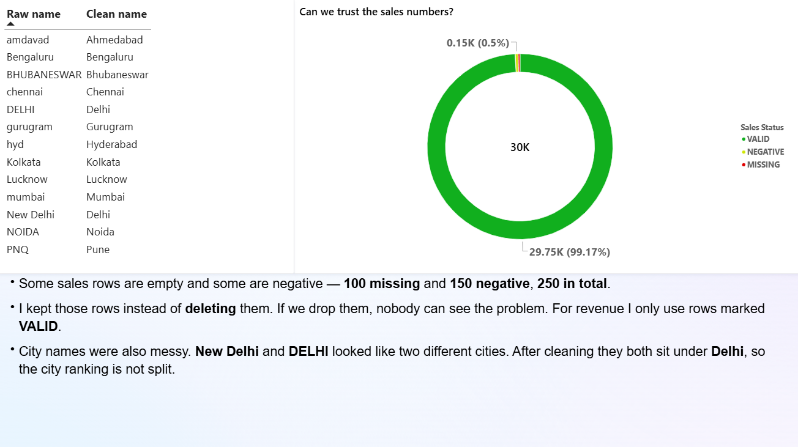
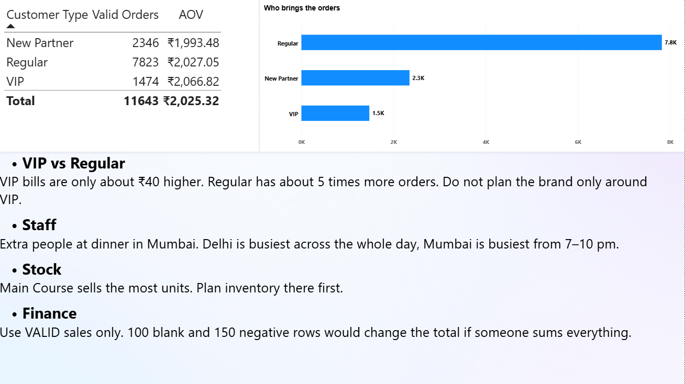

# Smart-Dine Analytics 🍽️📊

Ordering platform data, prepped and transformed into decisions.

MySQL → Apache Hop → Databricks → Power BI

---

## About this project

In this project, data is taken from an original database, cleaned and stored in a warehouse for analysis and visualization in four pages Power BI report.

The goal was not to build charts right away. The goal was to ask a simple question - could this dataset be trusted for any business decisions?

There are four tables. `fact_order_lines` contains every item on the receipt (30,000 rows). Around it there are customers (1,500), products (50) and locations (15). This structure is called star schema. In Power BI it looks like this three relationships:

- fact.customer_id → dim_customers.customer_id
- fact.product_id → dim_products.product_id
- fact.location_id → dim_locations.location_id

A line is an item on the receipt. A receipt is a bill. There are around 30,000 items in 12,000 bills.

---

## Business problem

A food delivery brand needs to understand the following questions:

- which cities produce the largest amount of orders
- what stocks the kitchen should hold first
- does customer have to wait too long for an order
- does finance department trust sales column
- do VIP customers really spend more

However, this raw data cannot be used to make such a statement directly. The same city is described in multiple ways as `DELHI`, `New Delhi` and `mumbai`. There were some negative numbers in the price column. And if you sum up the sales column as it is, the company total will be wrong. If you aggregate by the raw city column, Delhi will seem to have two markets.

---

## Tools and their role in this project

**MySQL**  
This is the source system where I loaded four raw tables. I didn't create the report based on MySQL.

**Apache Hop**  
Cleaning process. I removed unnecessary spaces from strings, normalized city values into one consistent city name, classified each row from sales column as either VALID, MISSING or NEGATIVE and saved 250 rows with the problem into separate reject file. I didn't delete any rows as it is important to demonstrate the problem existed.

**Databricks**  
A data warehouse where I performed SQL, joined the four tables and received the data that powers the dashboard.

**Power BI**  
This is the report which consists of 4 pages: Demand, Delay, Quality and Decisions.
---

## What I did

1. Loaded the four tables in MySQL.
2. Created a Hop pipeline that loads these tables.
3. Cleaned text and standardized city names (`DELHI` and `New Delhi` were standardized as Delhi).
4. Marked the sales data quality issues and moved them to a reject file.
5. Loaded the dimension tables, which are smaller in size, in Databricks via Hop.
6. Loaded the fact table in Databricks using the cleaned CSV since live insert of 30,000 rows in Hop was not working well in the free warehouse.
7. Answered the business questions with SQL, but had to TRIM the join keys since some ids had spaces.
8. Connected the same four tables in Power BI and created the report.

---

## Issues I ran into and how I solved them

It took forever to upload 30,000 rows of facts into Databricks through Hop on the free Databricks instance. So I uploaded the clean CSV file instead.

Preview from Databricks showed only 100 rows. Used COUNT(*) afterwards. The actual numbers are 1,500 / 50 / 15 / 30,000.

Join didn’t show any results due to presence of whitespace in some id values. Using TRIM on the join keys helped.

Another thing is to not leave Truncate on and not to overwrite the wrong table. Both resulted in data loss which had to be uploaded again.
---

## Dashboard

Demand is a measure of where the orders come from, what is selling, and when during the day.
Delay is the measure of waiting time.
Quality is a measure of low prices and confusing city names.
Decisions are what I would recommend to a manager.

---

## Answers from the dashboard

- 29,750 valid items, on 11,643 bills. Average bill amount of about ₹2,025. Sales amount of about ₹23.58 million.
- Most demand occurs in the cities of Delhi, Mumbai, and Lucknow throughout the day.
- In the evening (7-10 pm), Mumbai is first. This is where I would hire additional employees.
- The category that sells the most plates is Main Course. Order stock of this first.
- Average delay seems fine, about 50 minutes. However, it is a problem when 37% of all items require more than an hour.
- There is no difference in peak and quiet hours in terms of speed.
- VIP bills are just ₹40 higher on average than Regular. Regular restaurants order about five times more than VIP. Our business is about Regular customers.
- There are 100 missing prices and 150 negative ones. Only VALID sales should be considered by Finance.

---

## In Short 

I checked if the data was reliable first. Next, I cleaned cities, detected anomalies, executed SQL, and created four dashboards. Graphs were created last.

SQL · Hop · Databricks · Power BI · data quality
